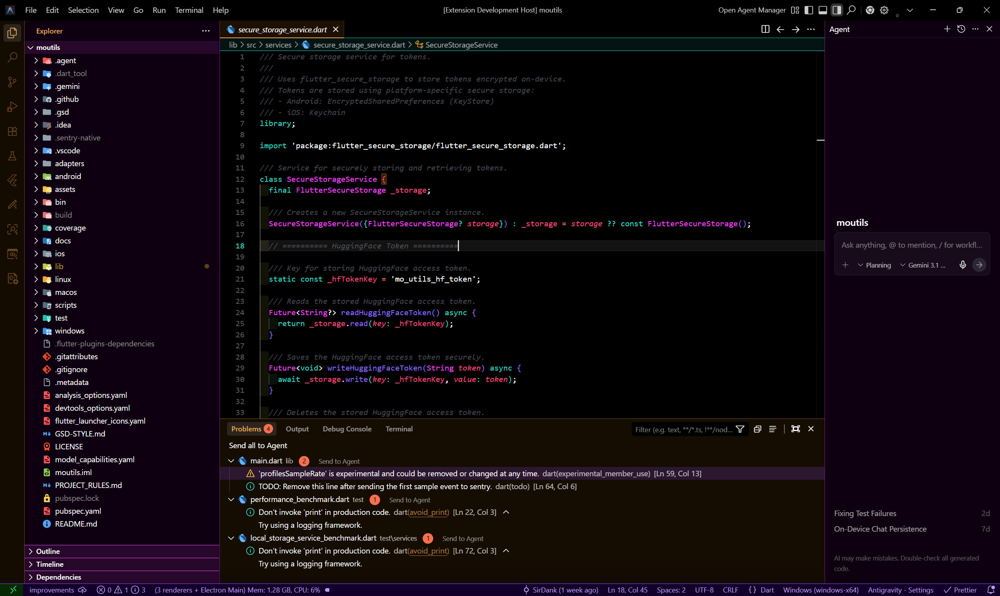
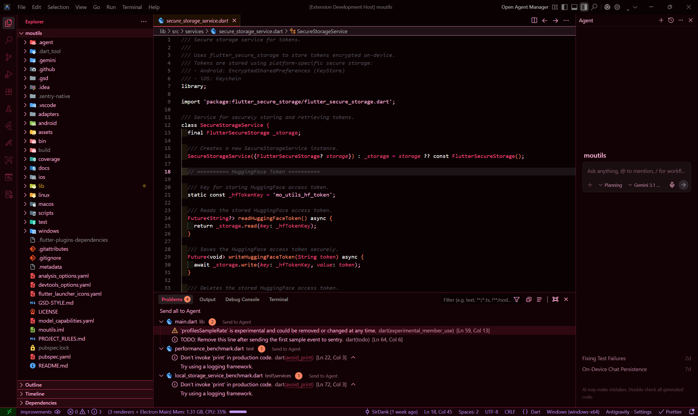
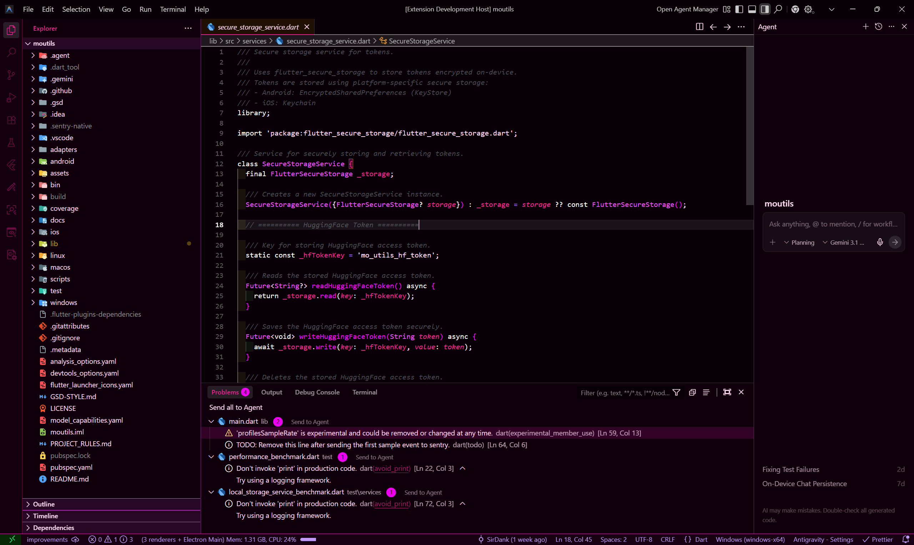
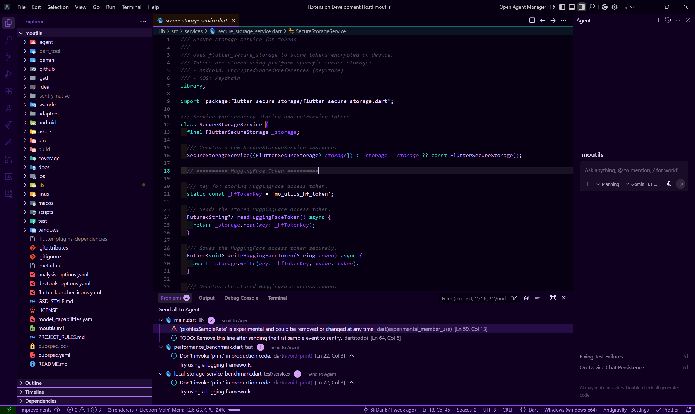

# Neon Shimmer

An Arcane and Cyberpunk inspired dark theme for neon lovers.

> If you find any problem with the color palettes or the contrast for any reason, feel free to open a ticket in the issue tracker with a screenshot. I'll address the problem in a matter of days. 🤞

## Themes

### Neon Shimmer (Original Improved)

#### Color Palette (Original)

It uses the neon theme taken from different sci-fi art works like Cyberpunk and Arcane. The colors and their codes are available below. All colors in the theme have been used from the palette.

**UI Elements Palette**  

**Tokens Palette**  

> Keep in mind that I have mixed things a bit between the two palettes and have not followed a strict rule. But the base colors have been picked from the palettes mentioned above.

---

### Neon Shimmer // Crimson Drive 🔴

Intense dark red-black backgrounds with red highlights dominating the interface and primary variables. Mapped primarily to `#E64471`.

---

### Neon Shimmer // Bubblegum Punk 🌸

A vivid magenta trip with different saturation levels of pink mapping out syntax structures against a dark pink canvas. Mapped primarily to `#F22294` and `#EE4CFC`.

---

### Neon Shimmer // Amethyst Core 🔮

Deep violet backgrounds accented by purple UI elements, lavender functions, and contrasting teal keywords. Mapped primarily to `#8E4AF5`.
